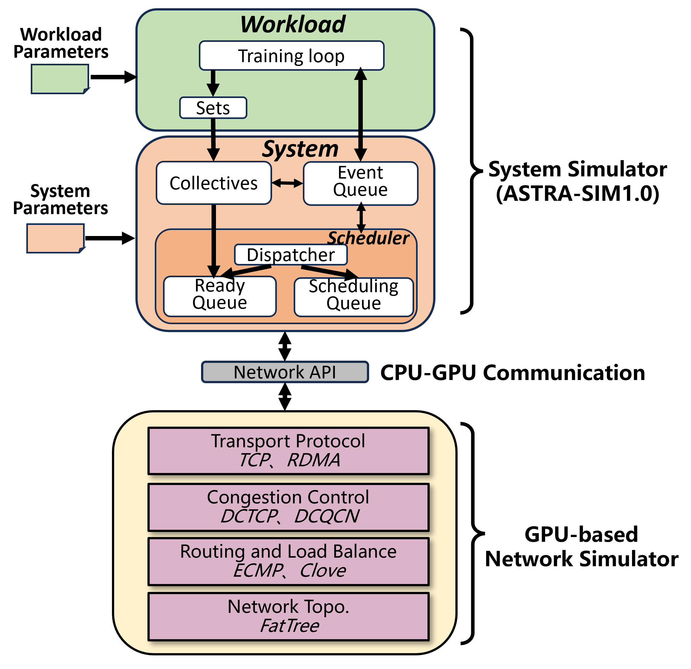

  

  

  

# Multiverse 1.0

  

  

Multiverse is a GPU-accelerated AI training simulator with high performance and high fidelity. It enables researchers to evaluate the performance of AI/LLM training systems given:

  

  

- Parallel strategies: TP, DP.

  

  

- Collective communication algorithms: Ring allreduce.

  

  

- Topology: Fattree, Bcube, HPN.

  

  

- Congestion control algorithms: DCQCN.

  
It's worth mentioning that Multiverse can also **run completely on the CPUs**, and it still applies Data-oriented Design (DOD) ideas to improve simulation efficiency.

Below is the architecture of Multiverse 1.0. In the coming months we will release Multiverse 2.0, which is fully GPU-accelerated and supports more LLM training options.

  



  

  

## Table of Contents

  

  

  

1. [Key Features](#key-features)

  

  

2. [Project Structure](#project-structure)

  

  

3. [Build Multiverse](#build-multiverse)

  
  

- [Build with Docker (Recommended)](#build-with-docker-recommended)


  

- [Build Manually](#build-manually)

  

  

4. [Run Multiverse](#run-multiverse)

  

  

- [Start the Simulators](#start-the-simulators)

  

  

- [Configuration Parameters](#configuration-parameters)

  

  

5. [Examples](#examples)

  

  

- [Training GPT-13B with 16 NPUs, TP group size=4, DP group size = 16, Fattree K=8](#1--training-gpt-13b-with-16-npus-tp-group-size4-dp-group-size--32-fattree-k8)


  

6. [Future Work](#future-work)

  

  

7. [Contributing](#contributing)

  

  

8. [License](#license)

  

  

  

## Key Features

  

  

-  **System Simulator**: Built on the `astrasim-1.0-ns3` framework for LLM framework-level simulation, added shared memory communication method and adapted the new network layer implementation to support the new network simulator, currently it runs on CPUs, in the future it will also be accelerated by GPU.
  

-  **Network Simulator**: Accelerated by Data-oriented Design (DOD) paradigm and GPU. It also can be run in CPU, which means that both System Simulator and Network Simulator are run in CPU.

  

-  **Shared Memory Communication**: Efficient data transfer between the System Simulator and the Network Simulator via shared memory.

  

  

## Project Structure

  

### System simulator (multiverse_system)

-  `astra-sim`: Contains the all code for `astrasim-1.0-ns3`.
  

-  `astra-sim\network_frontend`: Includes the new implementation code for the network layer interface.

  

### Network simulator (multiverse_network)

-  `external`: Include some ECS engine repos.

  

-  `src`: The network simulator based on ECS engine repos and cuda.

  

-  `scripts`: The start scripts for simulation.

  
  

## Build Multiverse

  

So far, the system simulator and the network simulator require different specific running environments.

  
  
  
  

  

### Build with Docker (Recommended)

  

**1. System simulator**

  
Pull docker from docker hub and create a docker container named as multiverse_ss.

```
docker pull naspthu/multiverse-ss:latest (or docker pull cjie.eu.org/naspthu/multiverse-ss:latest)

docker run -itd --privileged -v path_to_workdir:path_to_workdir -p 11110:22 --gpus all --security-opt seccomp=unconfined --ulimit memlock=-1:-1 --cap-add SYS_NICE --cap-add IPC_LOCK --ipc=host --restart=unless-stopped --name multiverse_ss naspthu/multiverse-ss:latest /bin/bash
```

Start up the container, clone the code using git, and then perform the compilation.

```
sudo docker exec -it  multiverse_ss  /bin/bash

cd ./path_to_workdir

git clone git@github.com:Harnets/multiverse.git

git submodule init 

git submodule update multiverse_system

cd path_to_workdir/multiverse/multiverse_system

cd astra-sim

git submodule init

git submodule update

cd extern/network_backend/ns3/simulation/

./waf configure (only required once)

cd path_to_workdir/multiverse/multiverse_system

./build/astra_ns3/build.sh -c

```

  

**2. Network simulator**

Pull docker from docker hub and create a docker container named as multiverse_net.

```
docker pull naspthu/multiverse-net:latest (or docker pull cjie.eu.org/naspthu/multiverse-net:latest)

docker run -itd --privileged -v path_to_workdir/multiverse/:path_to_workdir/multiverse/ -p 11111:22 --gpus all --security-opt seccomp=unconfined --ulimit memlock=-1:-1 --cap-add SYS_NICE --cap-add IPC_LOCK --ipc=host --restart=unless-stopped --name multiverse_net naspthu/multiverse-net:latest /bin/bash
```


Start up the container, clone the code using git, and then perform the compilation.

```
sudo docker exec -it  multiverse_net  /bin/bash 

cd ./path_to_workdir

git clone --recursive git@github.com:Harnets/multiverse.git
cd path_to_workdir/multiverse/multiverse_network/

mkdir build

cd build

cmake ..

make -j

cd ..

pip install -e .

```

  
  
  

### Build Manually

  

#### System Simulator

  

**1. Prepare the running environment**

The process can be seen in the README of [multiverse system](https://github.com/tiancai4652/multiverse_system?tab=readme-ov-file#instructions-for-compiling--running-ns3-as-the-network-simulator)
  

**2. Download the repo**

  

```

git clone git@github.com:Harnets/multiverse.git

```

  

**3. Complete the build for the system simulator**

```
cd path_to_workdir/multiverse/multiverse_system

git submodule init 

git submodule update multiverse_system

cd path_to_workdir/multiverse/multiverse_system

cd astra-sim

git submodule init

git submodule update

cd path_to_workdir/multiverse/multiverse_system/extern/network_backend/ns3/simulation/

./waf configure (only required once)

cd path_to_workdir/multiverse/multiverse_system

./build/astra_ns3/build.sh -c

```

  

  

#### Network Simulator

  

**1. Prepare the running environment**

The process can be seen in the README of [multiverse network](https://github.com/Harnet/multiverse_network.git)


  

**2. Clone the repository:**

  

```

git clone --recursive git@github.com:Harnets/multiverse.git

```

  

**3. Build the network simulator:**

  

```

cd path_to_workdir/multiverse/multiverse_network/

mkdir build

cd build

cmake ..

make -j

cd ..

pip install -e .

```

  
  
  
  

## Run Multiverse

  

### Start the Simulators

  
Note: You need to first start the system simulator, then run the network simulator. The order matters!

  

**1. Start system simulator**


```
cd path_to_workdir/multiverse/multiverse_system

./build/astra_ns3/build.sh -d

```

  

  

  

**2. Start network simulator**

  

```
cd path_to_workdir/multiverse/multiverse_network/

bash run.sh ("--enable_gpu_sim" controls the network simulator is run on CPUs or GPUs)

```

  

  

  

### Configuration Parameters

  

  

  

-  **Workload configuration**: Please refer to `astra-sim/scripts/workload_generator/README.md` for details.

  

  

  

-  **Network simulator configuration**: You can configure the topology, congestion control algorithms, etc. For example, to set the fattree topology and CC algorithm:

  

  

  

```

python scripts/run.py --num_env $num_env --enable_gpu_sim 'cpu' --fattree_K $fattree_K --cc_method $cc_method

```
  

  

## Examples

### 1  Training GPT-13B with 16 NPUs, TP group size=4, DP group size = 32, Fattree K=8
 
#### Configuration: 

##### System Simulator Configuration
| Parameter                  | Description                              | Default Value                                                      |
|----------------------------|------------------------------------------|--------------------------------------------------------------------|
| `-tp  --tp_size`            | TP group size | 4 |
| `-dp  --dp_size`            | DP group size | 32 |
| `-w  --workload`          | Path to workload                         | `./A100-128-Megatron-GPT13B-tp4-pp1-dp32.txt`                                             |

##### Network Simulator Configuration
| Parameter                  | Description                              | Default Value                                                      |
|----------------------------|------------------------------------------|--------------------------------------------------------------------|
| `MAX_NPU_FLOW_NUM            | Max length of queue for store the new/finished flow event | 2000(must > #NPU) |
| `-k  --fattree_k`            | Fattree K | 8 |
| `-c  --cc_method`          | congestion control method(0 is DCQCN, 1 is HPCC, ...)                         | 0 |` 

#### Run Simulation
**1. Start system simulator**

```

./build/astra_ns3/build.sh -d

```


**2. Start network simulator**


```

bash run.sh

```


## Future Work

|    |                 |                       |                      |                    |
|:-------------------------|:--------------------|:--------------------------|:-----------------------|:------------------------|
| **Strategy/Algorithm**   | TP✔️                | DP✔️                      | PP                     | EP✔️                    |
| **Collective Communication** | Ring allreduce✔️   | Halving doubling allreduce | Binary tree allreduce   | /                       |
| **Topology**             | Fattree✔️          | HPN                       | Rail-optimized         | Bcube                   |
| **Congestion Control**   | DCQCN✔️            | HPCC                      | Timely                 | Poseidon                |
| **Scale up network DES** | PCIe               | NVLINK                    | TTPoE                  | UALink                  |


<small>✔️ indicates that the corresponding function is ready in Multiverse 1.0. Others are future works.</small>

  
  


## Contributing

  

Contributions are welcome! Feel free to report issues or submit pull requests. Please follow our contribution guidelines.

## Contact Us
multiverse@harnets.ai

## License

  

This project is licensed under the MIT License.
